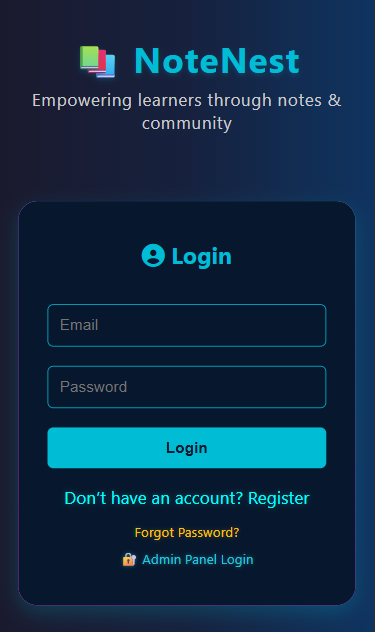
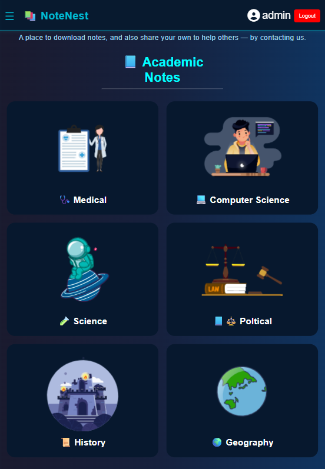
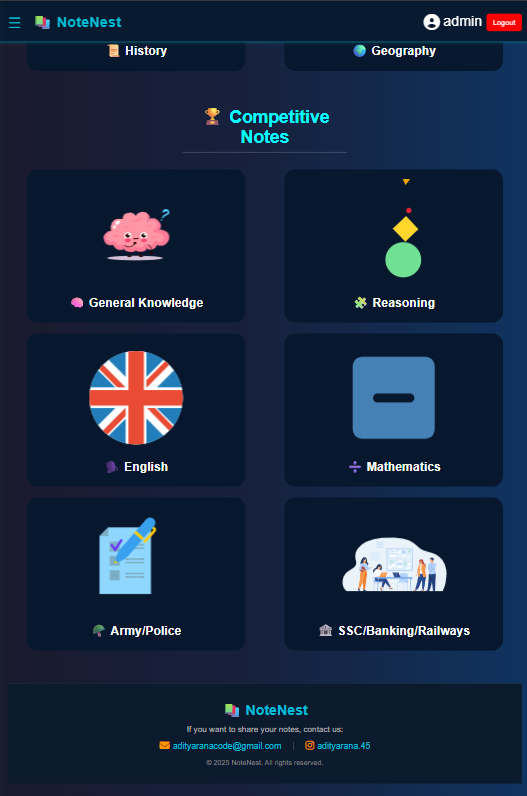
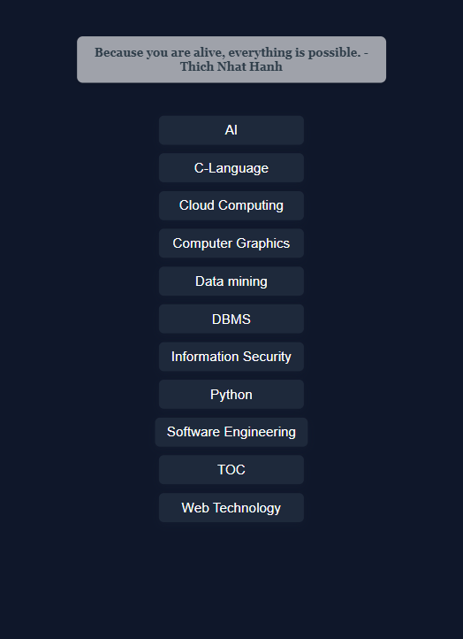
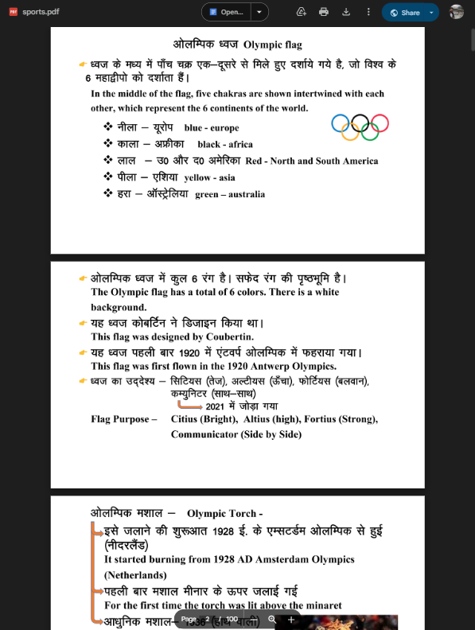
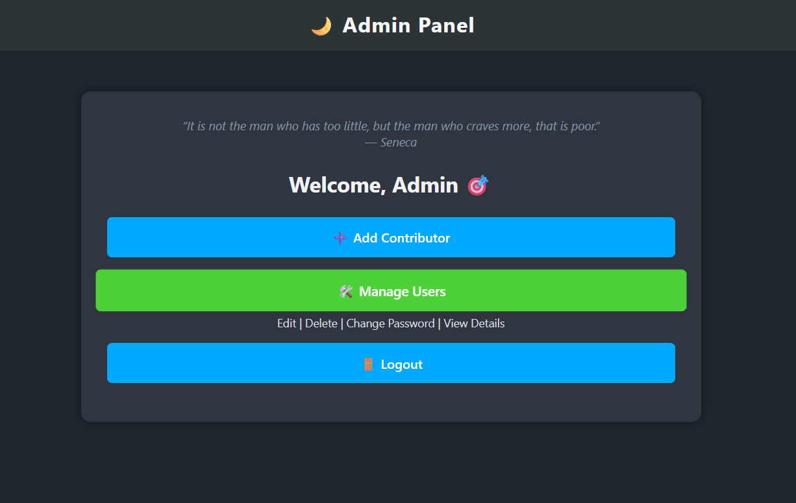

📝 NoteNest is a Laravel-based secure notes platform where users can register and log in to access and download notes uploaded by the admin. Notes are not public — users can share their notes after contacting the admin.

## 📸 Screenshots

### 🔐 Login Page

### 🔐 home Page

### 🔐 home Page

### 🔐 computer notes

### 🔐 download  notes

### 📋 Dashboard

## 🛠️ Tech Stack

- **Framework**: Laravel 10  
- **Language**: PHP 8  
- **Database**: MySQL  
- **Frontend**: Blade Templates, Bootstrap 5  
- **Version Control**: Git & GitHub

---

## 📌 Author

Developed with ❤️ by [Aditya Rana](https://github.com/AdityaRana45)
